# Peblo Notes

Peblo Notes is a full stack AI-powered collaborative notes workspace built as part of the Peblo Full Stack Developer Challenge. It provides a minimal, focused environment for creating, organizing, and synthesizing markdown-based notes without unnecessary abstractions.

## Features

- **Authentication**: Stateless JWT-based authentication via HTTP-only cookies.
- **Notes Workspace**: Markdown-supported editor with categorized organization.
- **AI Summaries**: Context-aware content summarization using Gemini.
- **AI Action Item Extraction**: Automatic task parsing from unstructured notes.
- **AI Title Suggestions**: Intelligent contextual naming based on note content.
- **Search & Filtering**: Real-time debounce searching by title, tag, or category.
- **Public Note Sharing**: Secure URL generation for sharing notes externally.
- **Dashboard Analytics**: Note statistics, activity tracking, and most-used tags.
- **Dark/Light Theme**: A cohesive slate/charcoal design system prioritizing readability.

## Tech Stack

**Frontend:**
- Next.js 16 (App Router)
- React 19
- TypeScript
- TailwindCSS (v4)

**Backend:**
- Next.js Edge Middleware & API Routes
- MongoDB + Mongoose

**Authentication:**
- Custom JWT implementation (jose + jsonwebtoken)
- bcryptjs

**AI Integration:**
- Google Gemini API (`@google/generative-ai`)

**UI Libraries:**
- shadcn/ui
- Framer Motion
- Recharts
- Lucide Icons

## Project Structure

```
peblo/
├── public/                 # Static assets (images, icons)
├── src/
│   ├── app/                # Next.js App Router
│   │   ├── (auth)/         # Grouped login/signup pages
│   │   ├── api/            # Backend API routes
│   │   └── dashboard/      # Protected workspace
│   ├── components/         # React components (ui, notes, layout)
│   ├── hooks/              # Custom React hooks (debounce, mobile state)
│   ├── lib/                # Utility functions, DB connection, Gemini config
│   └── models/             # Mongoose schemas (Note, User, Tag, Category)
```

## Environment Variables

See `.env.example` for the required configuration. Copy this file to `.env.local` to run the project locally.

Required variables:
- `MONGODB_URI`: Connection string for the MongoDB instance.
- `JWT_SECRET`: Secret key used for signing session tokens.
- `GEMINI_API_KEY`: API key for accessing Google's Gemini models.
- `NEXT_PUBLIC_APP_URL`: Base URL of the application (e.g., `http://localhost:3000`).

## Installation & Setup

1. **Clone the repository:**
   ```bash
   git clone https://github.com/SarveshHardas/PebloNotes-AIBackendRepo.git
   cd PebloNotes-AIBackendRepo
   ```

2. **Install dependencies:**
   ```bash
   npm install
   ```

3. **Configure environment variables:**
   ```bash
   cp .env.example .env.local
   # Edit .env.local with your actual database and API credentials
   ```

4. **Run the development server:**
   ```bash
   npm run dev
   ```

## Running the Project

The project is structured as a monolith using Next.js. 
- **Local Development**: Running `npm run dev` starts both the frontend client and the backend API routes concurrently.
- **Production Build**: Use `npm run build` to compile the optimized Next.js project, followed by `npm start` to run the production server.

## Demo Video

(https://drive.google.com/drive/folders/1zesjFvo95Dg8lEwqViaBi9AW5t1ASG6a?usp=sharing)

*(A 5–10 minute walkthrough covering authentication, notes workflow, AI features, sharing, and the analytics dashboard.)*

## Sample Outputs

### Web Application
- **Landing Page**:
  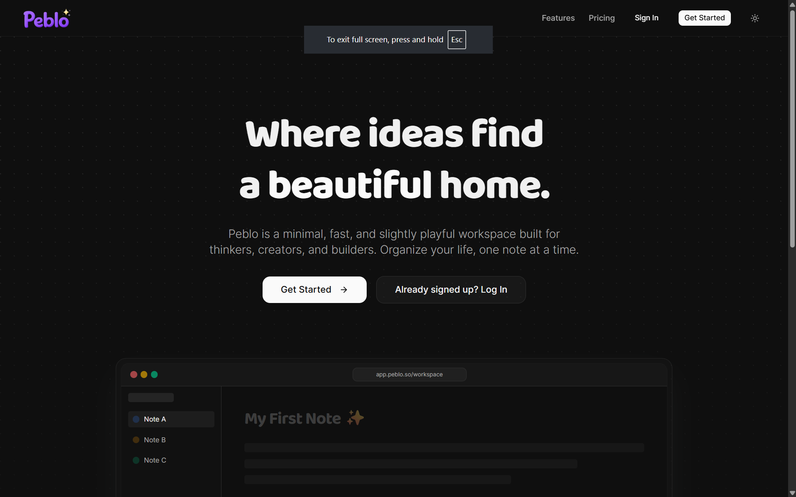
- **Login / Signup**:
  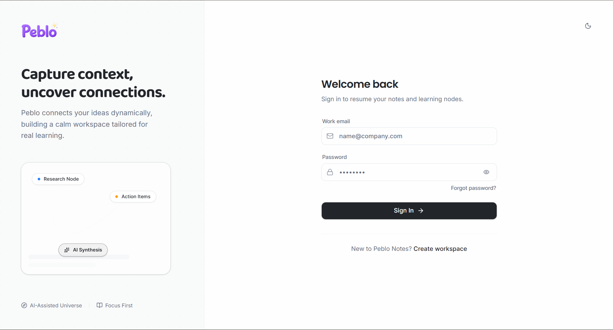
  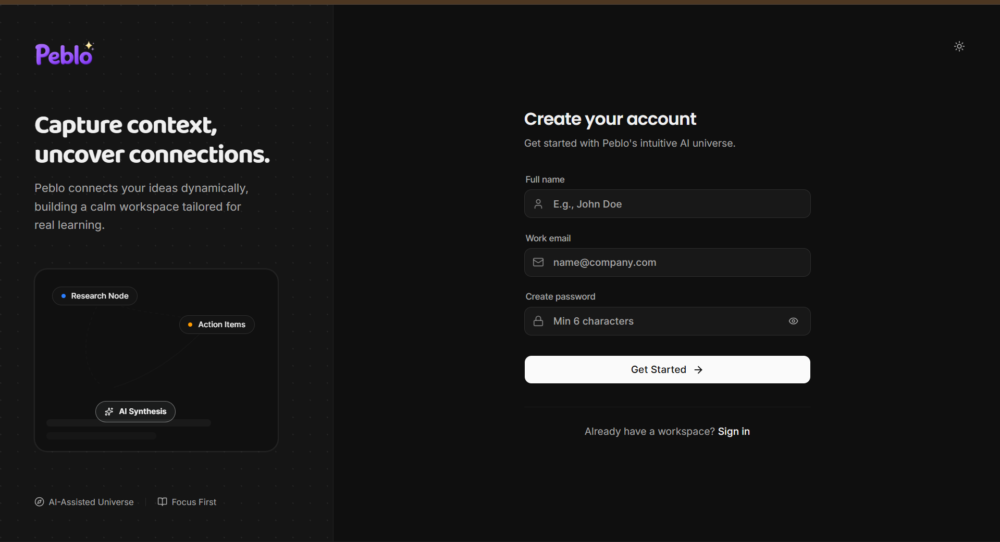
- **Dashboard Views**:
  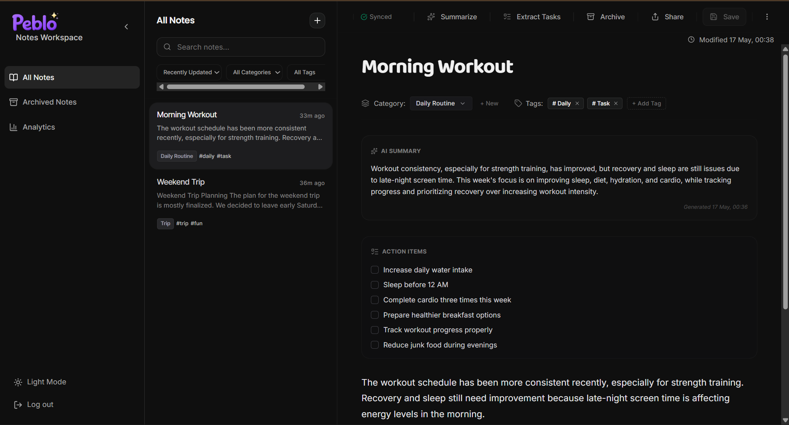
  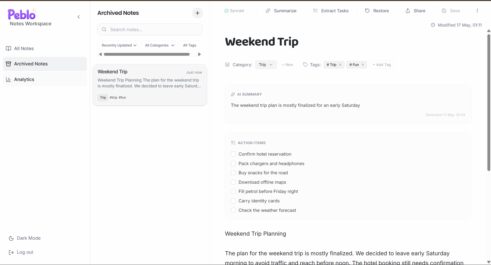
- **Analytics View**:
  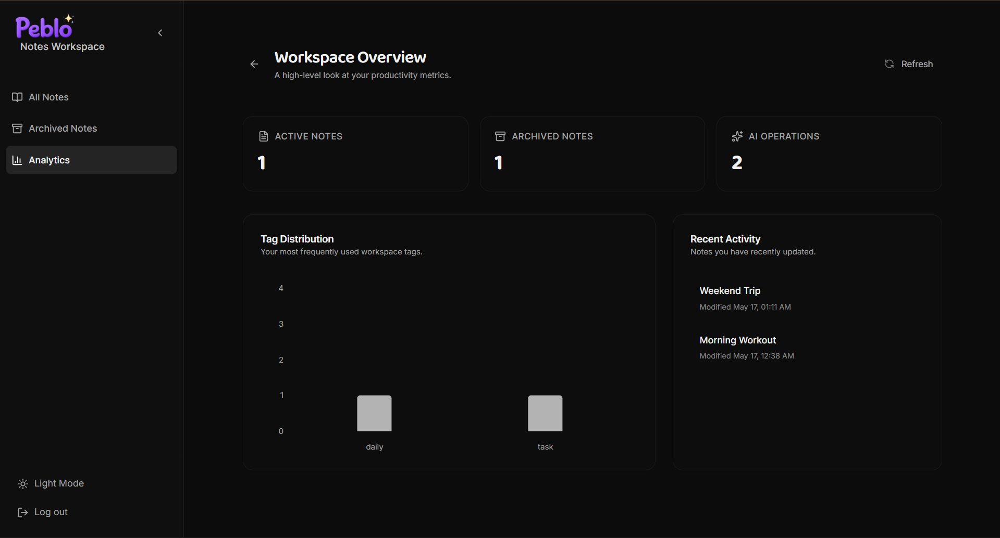

### Postman API
- **Authentication**:
  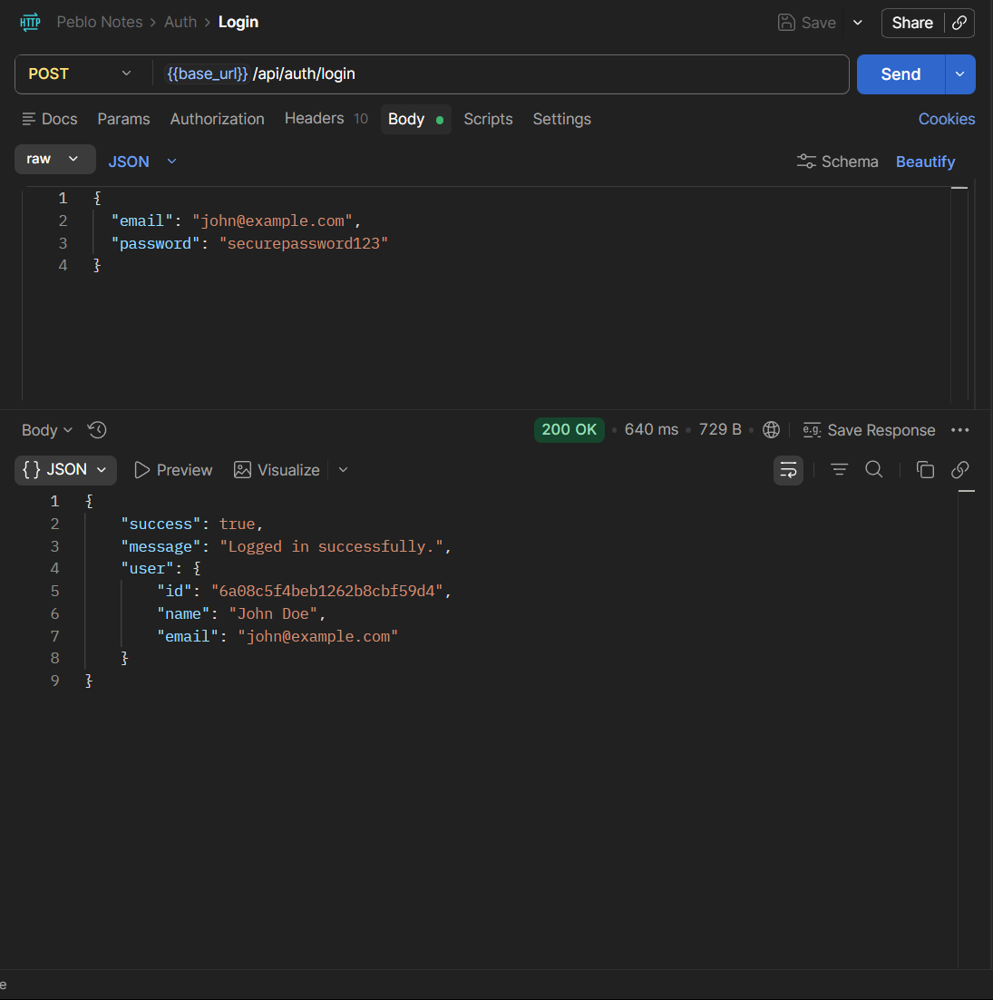
- **Notes & Sharing**:
  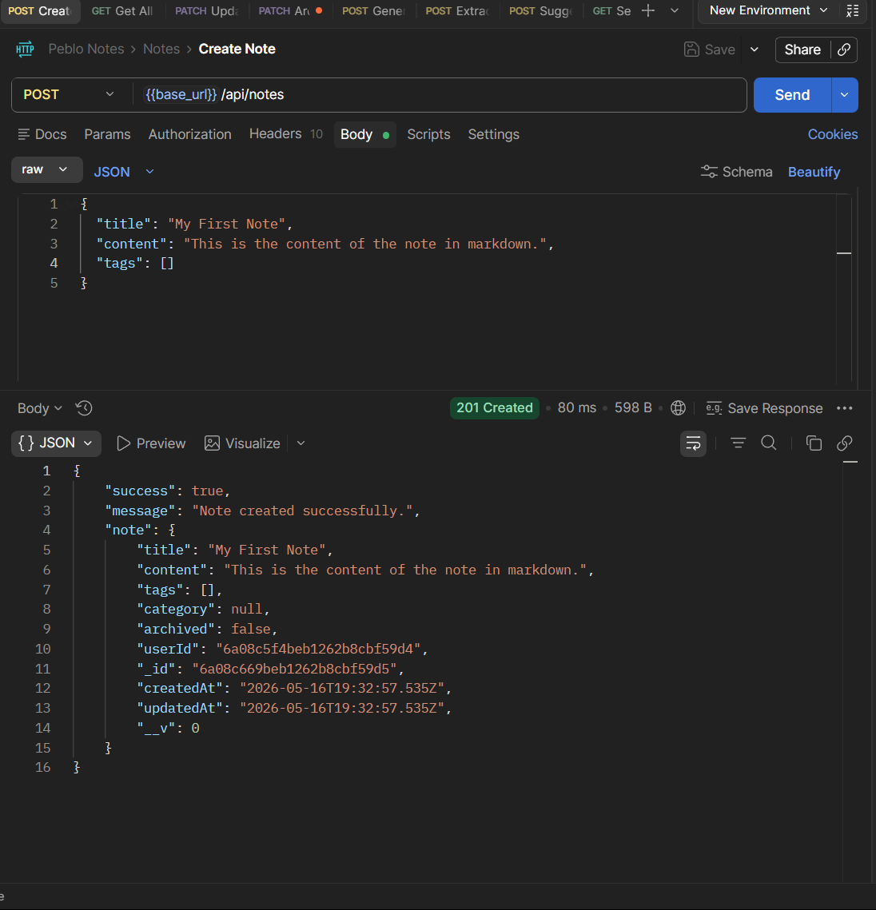
  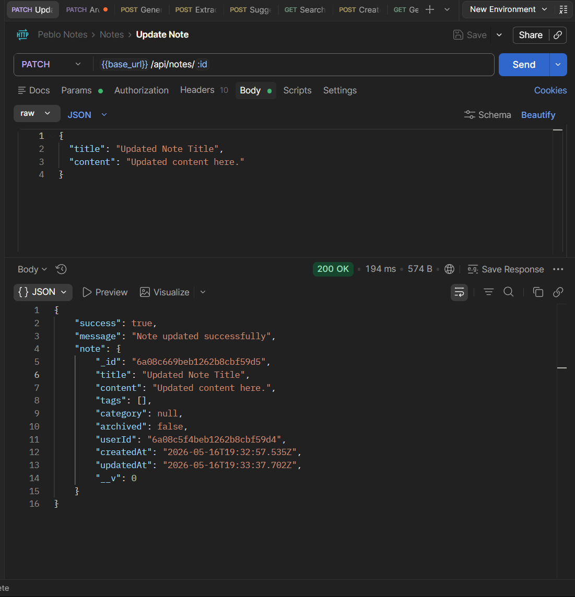
  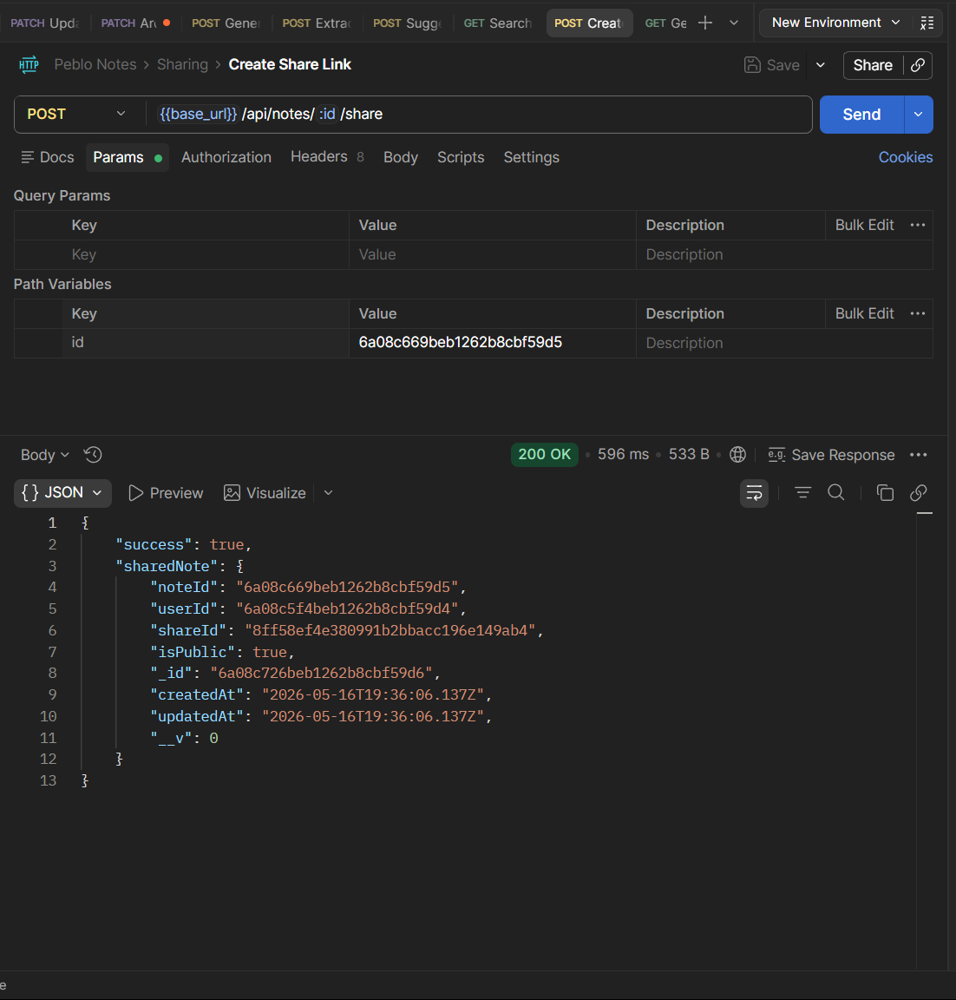
- **AI Integration**:
  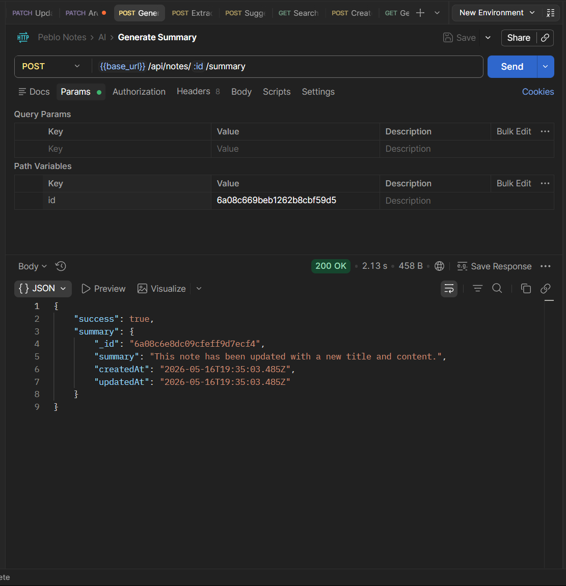
  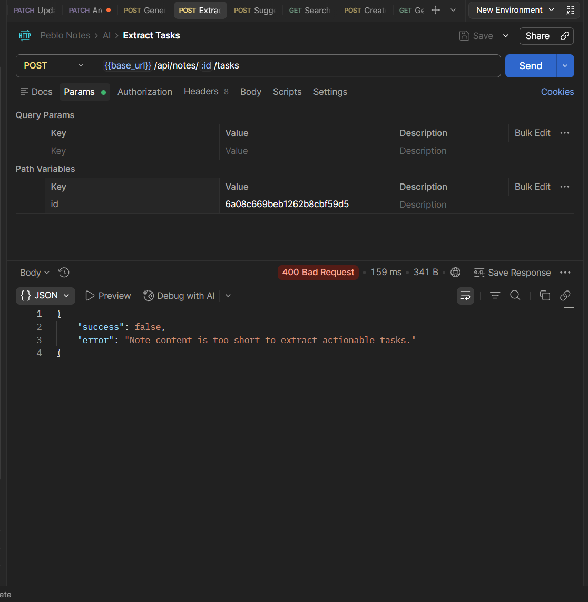
- **Analytics**:
  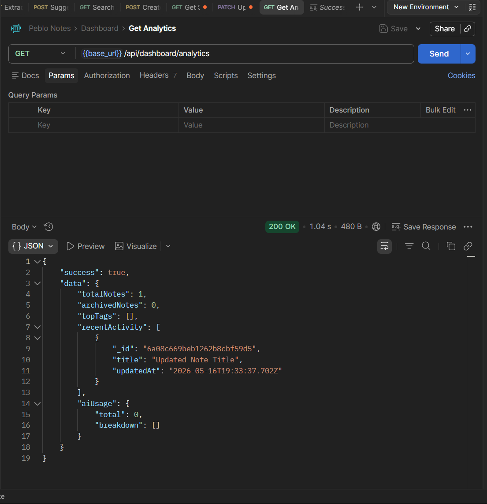

## Architecture Notes

- **Next.js App Router**: Chosen for its simplified server-side API integration (`/api` routes) and native edge computing support.
- **Authentication**: Stateless session management. A JWT is minted on login, stored securely in an `HttpOnly` cookie, and verified seamlessly in Next.js middleware using the `jose` library (edge compatible) to protect routes before rendering.
- **Gemini Integration**: Housed within a centralized `/lib/gemini.ts` handler, processing specific prompt-engineered commands (like extraction and summarization) via REST API routes to prevent exposing keys on the client.
- **MongoDB**: Used directly via Mongoose. The models are fully typed and lazily initialized across API routes to prevent cold-start connection leakage.

## Accessibility & UX Notes

- **Responsive Design**: Fluid layouts relying on CSS Grid/Flexbox to adapt gracefully from mobile to ultrawide displays. The sidebar cleanly collapses into a bottom sheet on smaller screens.
- **Theming**: Fully supported system, light, and dark modes. The dark mode utilizes a mature slate/charcoal palette rather than pure `#000` to reduce eye strain during extended reading.
- **UX Considerations**: Implemented subtle loading states (`Loader2`), debounce logic on search, accessible semantic HTML, and immediate optimistic-like UI feedback using `sonner` toasts for a native app feel.
